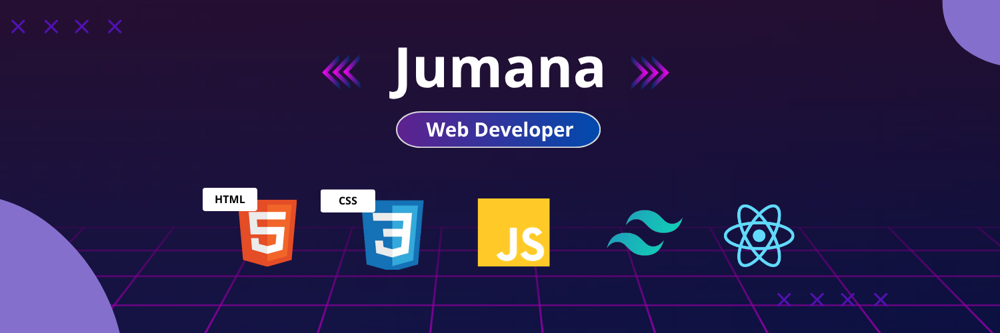

  

<h3 align="center">
  
</h3>

<h2 align="center">👩‍💻 About Me</h2>

I am a passionate <b>Web Developer</b> with a background in <b>Computer Science and Engineering</b>, who enjoys building modern, responsive, and user-friendly web applications. I love turning ideas into real-world projects using clean code and creative design. I am always eager to learn new technologies and improve my development skills.

 

<h3 align="center">🚀 Current Focus</h3>
<ul style="max-width: 700px; margin: auto; line-height: 1.8; font-size: 15px;">
  <li>🌱 I am currently exploring <b>Next.js</b> and advanced <b>React</b> concepts</li>
  <li>💻 I am working on frontend projects and improving <b>UI/UX design</b></li>
  <li>🚀 I enjoy building responsive and interactive web applications</li>
  <li>📚 Continuously learning and upgrading my technical skills</li>
</ul>

<h2 align="center">🛠️ Skills</h2>

  <!-- Frontend -->
  
  
  
  
  

<h2 align="center">Tools I work with:</h2>

  <!-- Tools -->
  
  
  

<h2 align="center">🌐 Connect with Me</h2>

  

  

  
  

  

